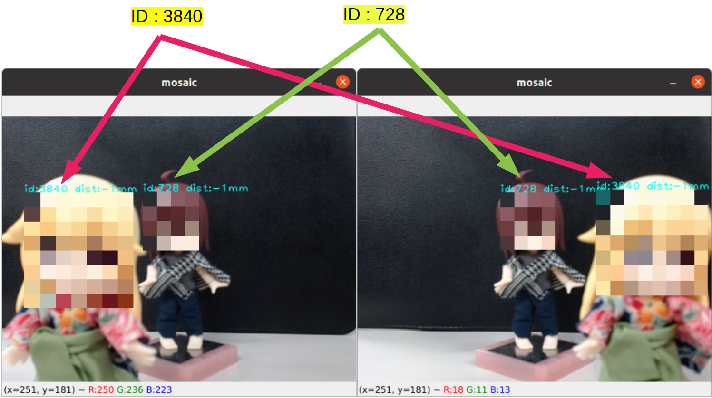
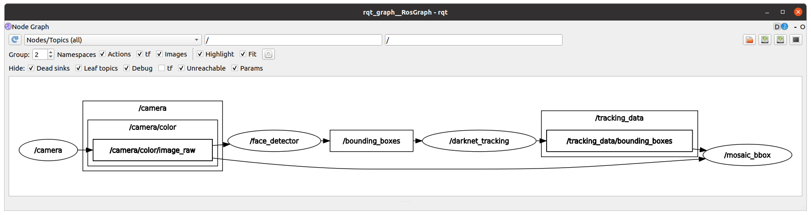
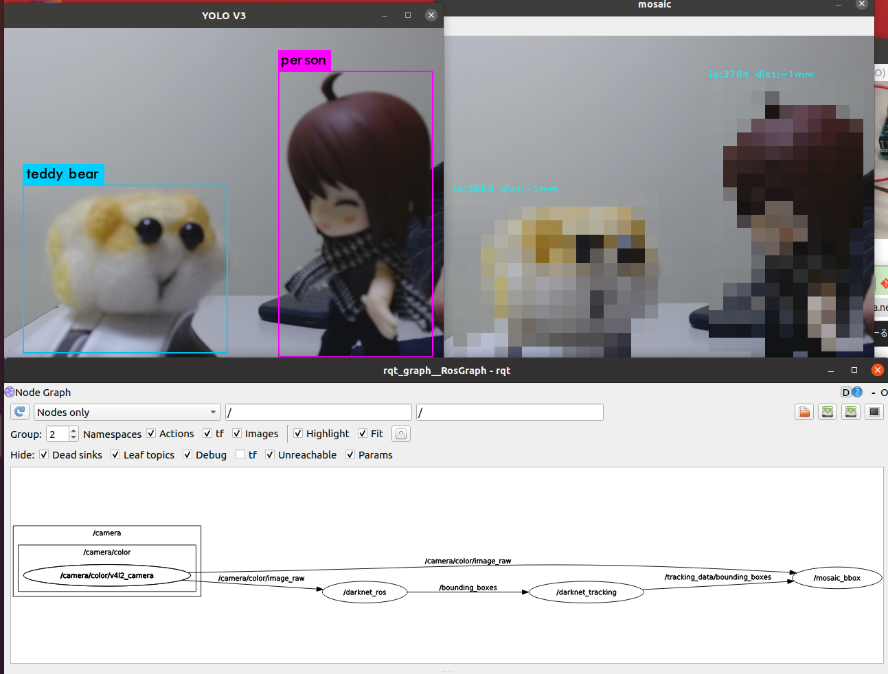

# motpy_ros
ROS example programs using [motpy](https://github.com/wmuron/motpy).

## Dependencies

- ROS2 Foxy
- OpenCV
- v4l2_camera
- [darknet_ros_msgs](https://github.com/ajaypaul2008/darknet_ros/tree/foxy/darknet_ros_msgs)
- [motpy](https://github.com/wmuron/motpy)

## Installation

```shell
# Create workspace
$ source /opt/ros/foxy/setup.bash
$ cd ~
$ mkdir -p ros2_ws/src
$ cd ros2_ws/src

$ sudo apt install ros-foxy-v4l2-camera

# Clone repository
$ git clone --branch ros2-foxy https://github.com/Ar-Ray-code/motpy_ros.git
$ pip3 install motpy_ros/requirements.txt

$ cd ~/ros2_ws
$ colcon build --symlink-install
```


## Demo (example_mosaic)

Connect your webcam (/dev/video0) and execute the following commands.

```shell
$ source /opt/ros/noetic/setup.bash
$ source ~/ros1_ws/devel/setup.bash
$ roslaunch motpy_ros example_mosaic.launch
```




### The role of each Node is as follows

- camera : Publish the video from the webcam.
- face_detector : "res10_300x300_ssd_iter_140000.caffemodel" (OpenCV) to detect faces.
- darknet_tracking : Tracking boundingboxes by motpy.
- mosaic_bbox : Display tracking image with mosaic.




### About topic

Run `$ rostopic echo /tracking_data/bounding_boxes` to check bounding_boxes topic

```bash
header: 
  seq: 464
  stamp: 
    secs: 1619954372
    nsecs: 821653734
  frame_id: "head_camera"
image_header: 
  seq: 0
  stamp: 
    secs: 0
    nsecs:         0
  frame_id: ''
bounding_boxes: 
  - 
    probability: 0.783602034603571
    xmin: 200
    ymin: 103
    xmax: 272
    ymax: 181
    id: 728
    Class: "face"
  - 
    probability: 0.8840379995412154
    xmin: 44
    ymin: 111
    xmax: 176
    ymax: 236
    id: 3840
    Class: "face"
...
```


### The role of each Node is as follows

- camera : Publish the video from the webcam.
- face_detector : "res10_300x300_ssd_iter_140000.caffemodel" (OpenCV) to detect faces.
- darknet_tracking : Tracking boundingboxes by motpy.
- mosaic_bbox : Display tracking image with mosaic.


### About topic

Run `$ rostopic echo /tracking_data/bounding_boxes` to check bounding_boxes topic

```bash
header: 
  seq: 464
  stamp: 
    secs: 1619954372
    nsecs: 821653734
  frame_id: "head_camera"
image_header: 
  seq: 0
  stamp: 
    secs: 0
    nsecs:         0
  frame_id: ''
bounding_boxes: 
  - 
    probability: 0.783602034603571
    xmin: 200
    ymin: 103
    xmax: 272
    ymax: 181
    id: 728
    class_id: "face"
  - 
    probability: 0.8840379995412154
    xmin: 44
    ymin: 111
    xmax: 176
    ymax: 236
    id: 3840
    class_id: "face"
...
```

## Using Service

- ROS2 version doesn't yet support srv.


## Use with darknet_ros

- motpy_ros can be used in conjunction with [darknet_ros](https://github.com/leggedrobotics/darknet_ros) to provide object tracking that takes advantage of darknet's strengths.

Example launch file : launch/example_darknet.launch.py




## Use with Arduino

- ROS2 version doesn't yet support ros2arduino.


## Reference

- https://github.com/wmuron/motpy
- https://github.com/leggedrobotics/darknet_ros/tree/master/darknet_ros_msgs

## About writer

- Ar-Ray : Japanese student. 
- Blog (Japanese) : https://ar-ray.hatenablog.com/
- Twitter : https://twitter.com/Ray255Ar

