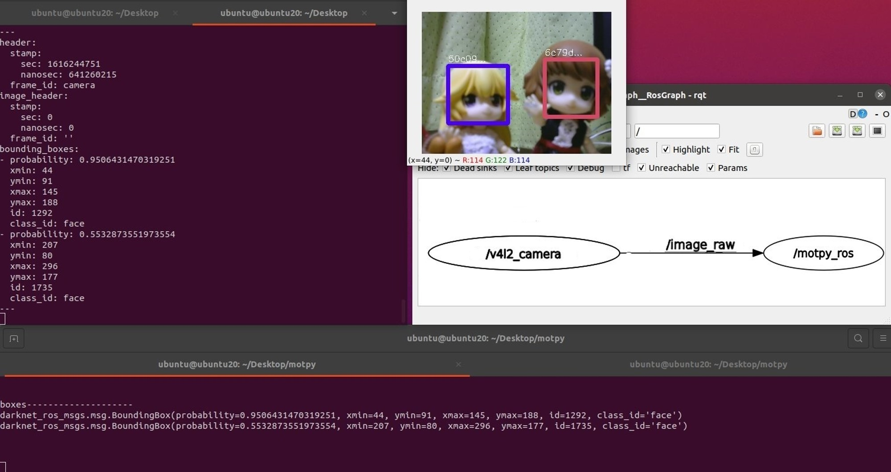

# motpy_ros
ROS example program using [motpy](https://github.com/wmuron/motpy).



## Dependencies

- ROS2 Noetic
- OpenCV4
- [darknet_ros_msgs](https://github.com/ajaypaul2008/darknet_ros/tree/foxy/darknet_ros_msgs)

## Installation

```shell
$ pip3 install opencv-python motpy

$ source /opt/ros/foxy/setup.bash
$ cd ~
$ mkdir -p ros1_ws/src
$ cd ros1_ws/src
$ git clone https://github.com/Ar-Ray-code/motpy_ros.git
$ cd motpy_ros
$ git checkout ros1-noetic
$ cd ~/ros1_ws
$ catkin_make
```

## Demo

```shell
$ source /opt/ros/noetic/setup.bash
$ source ~/ros1_ws/devel/setup.bash
$ ros2 launch motpy_ros face_tracking.launch.py
```

## About face_tracking.py

- This program was created with reference to [this repository](https://github.com/wmuron/motpy/blob/master/examples/webcam_face_tracking.py).

- Downloaded weights are saved in `${HOME}/.cache/motpy_ros/`.

### Subscribe topic

- `image_raw` (sensor_msgs/msg/Image) : Input image msg.

### Publish topic

- `bounding_boxes` : Output bounding_boxes msg of darknet_ros_msgs.
  - If you want to get tracking id, please use `BoundingBoxes.BoundingBox.id`.
  - Header is same as subscribe topic.
  - `class_id` is fixed to "face".

## Reference

- https://github.com/wmuron/motpy
- https://github.com/ajaypaul2008/darknet_ros/tree/foxy/darknet_ros_msgs

## About writer

- Ar-Ray : Japanese student. 
- Brog(Japanese) : https://ar-ray.hatenablog.com/
- Twitter : https://twitter.com/Ray255Ar

