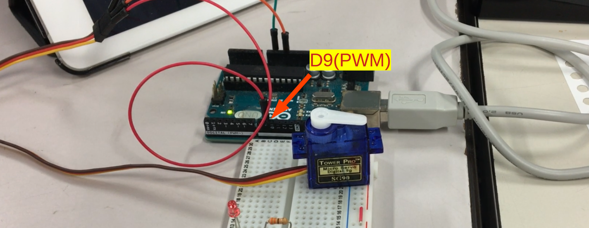
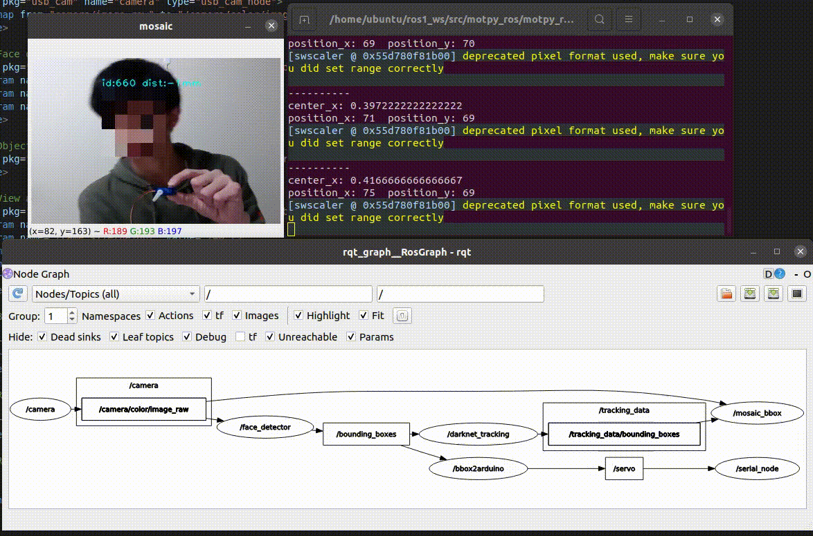

# motpy_ros
ROS example programs using [motpy](https://github.com/wmuron/motpy).

## Dependencies

- ROS1 Noetic
- OpenCV4
- [darknet_ros_msgs](https://github.com/leggedrobotics/darknet_ros/tree/master/darknet_ros_msgs)
- ros-noetic-usb_cam
- [motpy](https://github.com/wmuron/motpy)

## Installation

```shell
# Create workspace
$ source /opt/ros/noetic/setup.bash
$ cd ~
$ mkdir -p ros1_ws/src
$ cd ros1_ws/src

# Clone repository
$ git clone --branch noetic-devel https://github.com/Ar-Ray-code/motpy_ros.git
$ cd motpy_ros
$ pip3 install requirements.txt

$ cd ~/ros1_ws/src
$ catkin_make
```


## Demo (example_mosaic)

Connect your webcam (/dev/video0) and execute the following commands.

```shell
$ source /opt/ros/noetic/setup.bash
$ source ~/ros1_ws/devel/setup.bash
$ roslaunch motpy_ros example_mosaic.launch
```


### The role of each Node is as follows

- camera : Publish the video from the webcam.
- face_detector : "res10_300x300_ssd_iter_140000.caffemodel" (OpenCV) to detect faces.
- darknet_tracking : Tracking boundingboxes by motpy.
- mosaic_bbox : Display tracking image with mosaic.


### About topic

Run `$ rostopic echo /tracking_data/bounding_boxes` to check bounding_boxes topic

```bash
header: 
  seq: 464
  stamp: 
    secs: 1619954372
    nsecs: 821653734
  frame_id: "head_camera"
image_header: 
  seq: 0
  stamp: 
    secs: 0
    nsecs:         0
  frame_id: ''
bounding_boxes: 
  - 
    probability: 0.783602034603571
    xmin: 200
    ymin: 103
    xmax: 272
    ymax: 181
    id: 728
    Class: "face"
  - 
    probability: 0.8840379995412154
    xmin: 44
    ymin: 111
    xmax: 176
    ymax: 236
    id: 3840
    Class: "face"
...
```

## Using Service

- motpy_bbox.srv can be turned into an object tracking program by incorporating motpy into object detection. service server needs to be passed a boundingbox message (darknet_ros_msgs).

Example launch file : launch/example_srv.launch


## Use with darknet_ros

- motpy_ros can be used in conjunction with [darknet_ros](https://github.com/leggedrobotics/darknet_ros) to provide object tracking that takes advantage of darknet's strengths.

Example launch file : launch/darknet_tracking.launch


## Use with Arduino

- Based on the data tracked by motpy_ros, you can create a program to track a single object with a servo motor.
- rosserial_arduino is required.


Example launch file : launch/tracking_servo.launch

- [Arduino Program](https://github.com/ros-drivers/rosserial/blob/noetic-devel/rosserial_arduino/src/ros_lib/examples/ServoControl/ServoControl.pde)：Use ros_lib/examples/ServoControl/ServoControl.ino and Rewrite 13 to 9 .

※ If there are more than two people, the operation may not be stable.






## Reference

- https://github.com/wmuron/motpy
- https://github.com/leggedrobotics/darknet_ros/tree/master/darknet_ros_msgs

## About writer

- Ar-Ray : Japanese student. 
- Blog (Japanese) : https://ar-ray.hatenablog.com/
- Twitter : https://twitter.com/Ray255Ar

